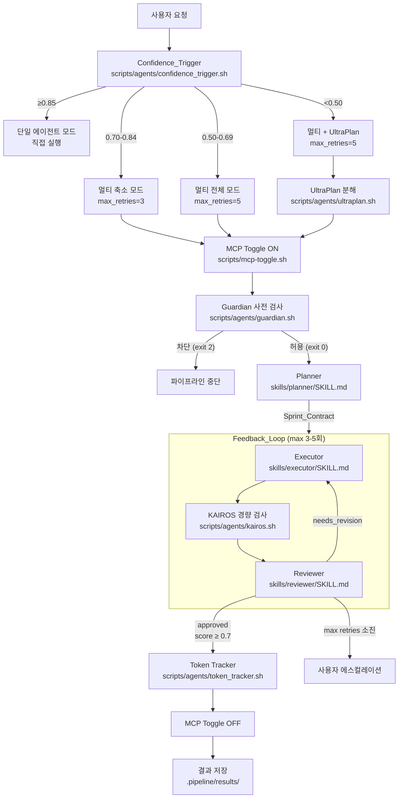
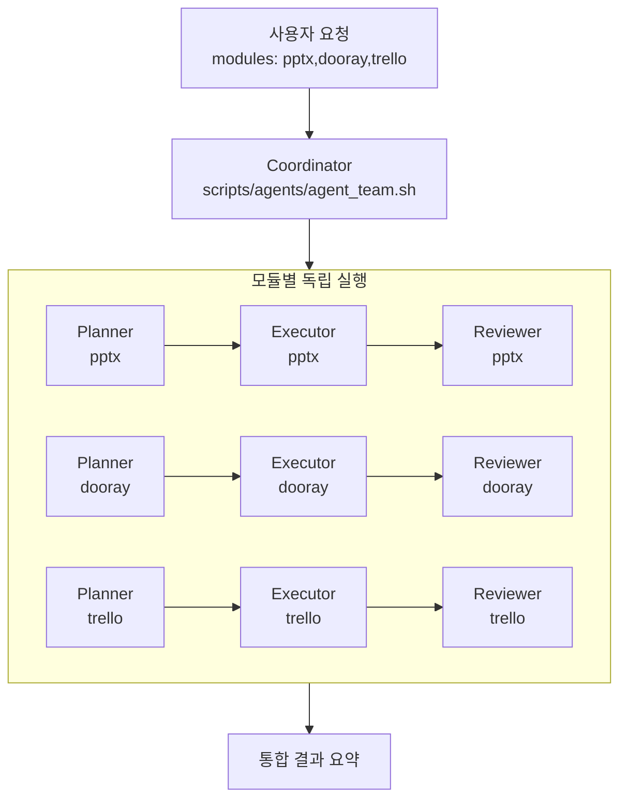
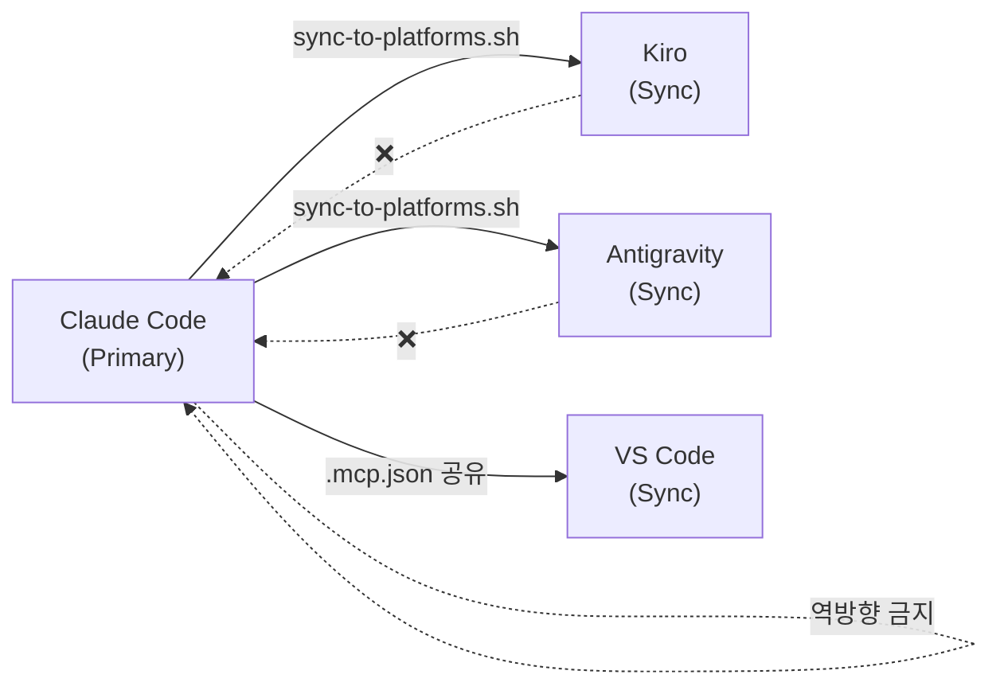
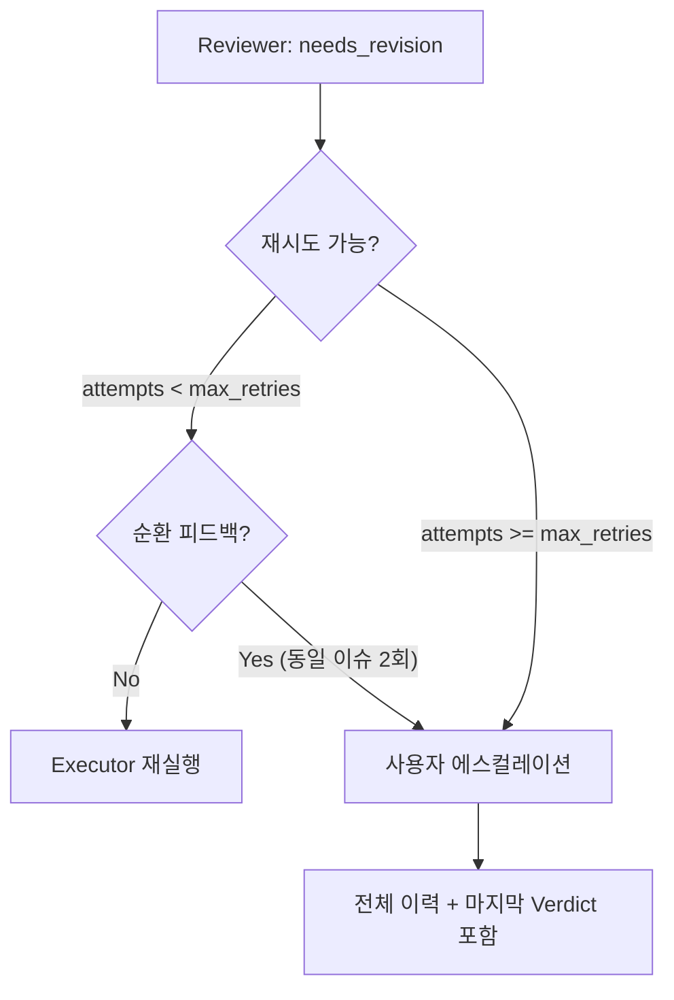

# Design Document: Harness Pipeline

## Overview

하네스 파이프라인은 7개 업무 모듈(pptx, docx, wbs, trello, dooray, gdrive, datadog)의 산출물을 자동 생성·검증하는 멀티 에이전트 시스템이다. GAN 영감의 Generator-Evaluator(Executor-Reviewer) 패턴을 적용하여, 산출물 생성과 검증을 독립 에이전트로 분리하고 적대적 리뷰 루프를 통해 품질을 보장한다.

핵심 설계 원칙:
- **역할 분리**: Planner(계획) → Executor(실행) → Reviewer(검증)를 독립 프로세스로 실행
- **정보 차단**: Reviewer는 Executor의 reasoning을 볼 수 없음 (자기 확인 편향 방지)
- **파일 기반 통신**: 에이전트 간 Handoff_File(JSON)로만 통신하여 컨텍스트 격리 보장
- **적응적 파이프라인**: Confidence_Trigger가 작업 복잡도를 평가하여 파이프라인 모드를 자동 결정
- **크로스 플랫폼**: Claude Code(Primary) → Kiro/Antigravity/VS Code 단방향 동기화

기술 스펙 레퍼런스: `specs/ai-agent-engineering-spec-2026.md` (23개 요구사항)

## Architecture

### 전체 파이프라인 흐름



### Agent_Team 모드 (다중 모듈)



### 크로스 플랫폼 동기화 흐름



### 디렉토리 구조

```
project-steer/
├── scripts/
│   ├── orchestrate.sh              # R1: 파이프라인 오케스트레이터
│   ├── mcp-toggle.sh               # R12: MCP 서버 토글
│   └── agents/
│       ├── call_agent.sh            # R7,R31: 서브에이전트 호출
│       ├── confidence_trigger.sh    # R9: 위험도 평가
│       ├── guardian.sh              # R5: 위험 명령 차단
│       ├── ide_adapter.sh           # R10: IDE 환경 감지
│       ├── kairos.sh                # R18: 경량 사전 감시
│       ├── auto_dream.sh            # R17: 메모리 정리
│       ├── ultraplan.sh             # R19: 계층적 분해
│       ├── token_tracker.sh         # R15: 토큰 관리
│       ├── harness_subtraction.sh   # R22: 최적화 분석
│       ├── agent_team.sh            # R21: 팀 협업
│       ├── git_worktree.sh          # R16: 병렬 실행
│       ├── sdd_integrator.sh        # R20: SDD 통합
│       └── sync_pipeline.sh         # R11: IDE 동기화
├── skills/
│   ├── orchestrator/SKILL.md        # R1: 오케스트레이터 역할
│   ├── planner/SKILL.md             # R2: 플래너 역할
│   ├── executor/SKILL.md            # R3: 실행자 역할
│   └── reviewer/SKILL.md            # R4: 검증자 역할
├── modules/
│   ├── pptx/SKILL.md                # R24: 프레젠테이션
│   ├── docx/SKILL.md                # R25: 문서
│   ├── wbs/SKILL.md                 # R26: WBS
│   ├── trello/SKILL.md              # R27: 칸반
│   ├── dooray/SKILL.md              # R28: 태스크/주간보고
│   ├── gdrive/SKILL.md              # R29: 파일 관리
│   └── datadog/SKILL.md             # R30: 모니터링
├── schemas/
│   ├── sprint_contract.schema.json  # R13: 실행 계획 스키마
│   ├── verdict.schema.json          # R14: 검증 결과 스키마
│   └── handoff_file.schema.json     # R6: 통신 파일 스키마
├── .pipeline/                       # 에이전트 런타임 디렉토리
│   ├── requests/                    # 요청 Handoff_File
│   ├── contracts/                   # Sprint_Contract
│   ├── outputs/                     # Executor 출력
│   ├── verdicts/                    # Reviewer Verdict
│   ├── results/                     # 최종 결과
│   ├── plans/                       # UltraPlan 태스크 트리
│   ├── suggestions/                 # KAIROS 제안
│   ├── metrics/                     # Harness_Subtraction 메트릭
│   ├── reports/                     # 최적화 보고서
│   └── archive/                     # Auto_Dream 아카이브
└── 크로스 플랫폼 설정
    ├── CLAUDE.md + .claude/         # Claude Code (Primary)
    ├── AGENTS.md                    # 범용 에이전트 지침
    ├── .kiro/                       # Kiro (Sync)
    ├── .gemini/                     # Antigravity (Sync)
    ├── .agent/                      # Antigravity 워크플로우
    └── .vscode/                     # VS Code (Sync)
```


## Components and Interfaces

### 1. Orchestrator (`scripts/orchestrate.sh`)

파이프라인의 중앙 조율자. I/O만 담당하며 코드 생성이나 검증 로직을 직접 수행하지 않는다.

**입력:**
- `$1`: 작업 설명 (자연어 문자열)
- `$2`: 대상 모듈(들) (쉼표 구분 가능: `pptx,dooray,trello`)

**출력:**
- `$RUN_DIR/summary.json`: 파이프라인 실행 결과 요약
- `$RUN_DIR/confidence_trigger.json`: Confidence_Trigger 평가 결과
- `$RUN_DIR/sprint_contract.json`: Planner 생성 계획
- `$RUN_DIR/exec_output_N.json`: 각 시도별 Executor 출력
- `$RUN_DIR/verdict_N.json`: 각 시도별 Reviewer 판정

**의존성:**
- `scripts/agents/ide_adapter.sh` (source): IDE 감지, 경로 매핑, `atomic_write`, `ensure_agent_dirs`
- `scripts/agents/confidence_trigger.sh`: 파이프라인 모드 결정
- `scripts/agents/guardian.sh`: 사전 안전성 검사
- `scripts/agents/ultraplan.sh`: 계층적 분해 (조건부)
- `scripts/agents/call_agent.sh`: 서브에이전트 호출
- `scripts/agents/agent_team.sh`: 다중 모듈 모드
- `scripts/agents/kairos.sh`: 경량 사전 감시
- `scripts/agents/token_tracker.sh`: 토큰 사용량 집계
- `scripts/mcp-toggle.sh`: MCP 서버 토글

**내부 흐름:**
1. 모듈명 유효성 검증 (`pptx|docx|wbs|trello|dooray|gdrive|datadog`)
2. Confidence_Trigger 실행 → mode, max_retries, ultraplan 결정
3. mode=single이면 즉시 종료
4. 다중 모듈이면 Agent_Team 모드로 분기
5. MCP 서버 활성화
6. UltraPlan 실행 (조건부)
7. Planner 호출 → Sprint_Contract 생성
8. Execute-Review 루프 (최대 max_retries회)
   - Guardian 사전 검사
   - Executor 호출 (이전 피드백 포함)
   - KAIROS 경량 검사
   - Reviewer 호출 (정보 차단 적용)
   - Verdict 파싱 → approved/needs_revision 판정
   - 순환 피드백 감지 (동일 이슈 2회 연속)
9. Token 리포트
10. MCP 서버 비활성화
11. 결과 요약 저장

### 2. Confidence_Trigger (`scripts/agents/confidence_trigger.sh`)

작업의 위험도·복잡도를 4차원으로 평가하여 파이프라인 모드를 결정한다.

**입력:**
- `$1`: 작업 설명
- `$2`: 대상 모듈

**출력 (JSON):**
```json
{
  "score": 0.62,
  "dimensions": {
    "ambiguity": 0.5,
    "domain_complexity": 0.4,
    "stakes": 0.3,
    "context_dependency": 0.3
  },
  "mode": "multi_full",
  "max_retries": 5,
  "ultraplan": false,
  "agent_team": false
}
```

**점수 산출 로직:**
- `ambiguity`: 요청 길이 기반 (짧을수록 모호)
- `domain_complexity`: 모듈별 고정 복잡도 맵 (datadog=0.6, wbs=0.5, pptx=0.4, ...)
- `stakes`: 보안/운영 키워드 탐지 (인증, delete, production → 고위험)
- `context_dependency`: 외부 데이터 의존 키워드 탐지 (WBS, Trello, API → 고의존)
- 종합: `1.0 - (ambiguity*0.25 + domain*0.25 + stakes*0.3 + context*0.2)`

**의존성:** 없음 (순수 Python 계산)

### 3. Guardian (`scripts/agents/guardian.sh`)

Pattern_Matcher 기반 위험 명령 사전 차단. Claude API 호출 없이 정규식만으로 200ms 이내 판정.

**입력 (stdin JSON):**
```json
{"tool_input": {"command": "rm -rf /"}}
```

**출력:**
- exit code 0: 허용 (경고 메시지 포함 가능)
- exit code 2: 차단 (stderr에 차단 사유)

**차단 패턴 (exit 2):**
`DROP DATABASE`, `DROP SCHEMA`, `kubectl delete namespace (kube-system|kube-public|default)`, `rm -rf /`, `git push --force main/master`, `mkfs.`, `dd if=... of=/dev/`, `chmod -R 777 /`

**경고 패턴 (exit 0 + stderr):**
`DROP TABLE`, `TRUNCATE`, `kubectl delete`, `docker compose down -v`, `git reset --hard`, `rm -rf`

**의존성:** 없음 (순수 bash + grep)

### 4. call_agent.sh (`scripts/agents/call_agent.sh`)

범용 서브에이전트 호출기. 플랫폼을 자동 감지하여 적절한 CLI로 라우팅.

**입력:**
- `$1`: 역할 (planner/executor/reviewer)
- `$2`: 입력 파일 경로
- `$3`: 출력 파일 경로
- `$4`: 모듈명 (선택)

**플랫폼 라우팅:**
1. `claude` CLI 존재 → `claude --print --system-prompt ... --output-format json`
2. `gemini` CLI 존재 → `gemini --system-instruction ... --json`
3. 미지원 → 가이던스 파일 생성 (exit 1)

**시스템 프롬프트 구성:**
- 기본: `skills/{role}/SKILL.md`
- Executor + 모듈 지정: `+ modules/{module}/SKILL.md`
- Reviewer: `+ skills/orchestrator/references/module-checklists.md`

### 5. IDE_Adapter (`scripts/agents/ide_adapter.sh`)

런타임 IDE 환경 감지 및 경로 매핑. 모든 에이전트 스크립트가 `source`하여 사용.

**감지 우선순위:**
1. `CLAUDE_CODE` 환경 변수 또는 `claude` CLI → `claude_code`
2. `KIRO_IDE` 환경 변수 또는 `.kiro/` 존재 → `kiro`
3. `ANTIGRAVITY` 환경 변수 또는 `.antigravity/` 존재 → `antigravity`
4. `VSCODE_PID` 환경 변수 또는 `.vscode/` 존재 → `vscode`
5. 기본값 → `kiro`

**제공 함수:**
- `detect_ide()`: IDE 환경 감지
- `ensure_agent_dirs()`: `.pipeline/` 하위 10개 서브 디렉토리 생성
- `atomic_write(target, content)`: 임시 파일 → mv 원자적 교체

**내보내기 변수:**
`IDE_NAME`, `AGENT_DIR`, `HOOKS_DIR`, `STEERING_DIR`, `CONFIG_FILE`, `MCP_FILE`

### 6. Agent_Team (`scripts/agents/agent_team.sh`)

다중 모듈 작업 시 Coordinator 역할. 각 모듈별 독립 파이프라인 실행 후 통합.

**입력:**
- `$1`: 작업 설명
- `$2`: 모듈 CSV (예: `pptx,dooray,trello`)

**실행 단계:**
1. 각 모듈별 Planner 호출 → 개별 Sprint_Contract
2. 각 모듈별 Executor 호출 → 개별 산출물
3. 각 모듈별 Reviewer 호출 → 개별 Verdict
4. 통합 결과 요약 생성

### 7. MCP Toggle (`scripts/mcp-toggle.sh`)

MCP 서버 on/off 토글. Primary(`.mcp.json`) 변경 후 Kiro에 단방향 동기화.

**명령:**
- `mcp-toggle.sh <server> on|off`: 서버 토글 + 동기화
- `mcp-toggle.sh status`: 전체 상태 표시
- `mcp-toggle.sh sync`: Claude Code → Kiro 동기화

**동기화 대상:**
1. `.mcp.json` (Primary)
2. `.kiro/settings/mcp.json` (워크스페이스)
3. `~/.kiro/settings/mcp.json` (사용자 레벨)

### 8. Sync_Pipeline (`scripts/agents/sync_pipeline.sh`)

IDE 간 설정 동기화. Claude Code → Kiro/Antigravity 단방향.

**명령:**
- `--status`: 모든 IDE 설정 파일 존재 여부 확인
- `--from claude_code --to kiro|all`: MCP 설정 동기화

### 9. 보조 에이전트

| 에이전트 | 스크립트 | 역할 | 트리거 |
|---------|---------|------|--------|
| KAIROS | `kairos.sh` | 파일별 경량 lint 검사 | PostToolUse Hook, 파이프라인 내 |
| Auto_Dream | `auto_dream.sh` | 7일+ 완료 파일 아카이브, 중복 제거 | 파이프라인 완료 후 |
| UltraPlan | `ultraplan.sh` | 계층적 태스크 분해 (3단계) | CT 점수 < 0.50 |
| Token_Tracker | `token_tracker.sh` | 토큰 사용량·비용 집계 | 파이프라인 완료 시 |
| Harness_Subtraction | `harness_subtraction.sh` | 컴포넌트 기여도 분석·최적화 제안 | 수동 실행 |
| Git_Worktree | `git_worktree.sh` | 병렬 실행용 worktree 관리 | 독립 Sprint_Contract 병렬 시 |
| SDD_Integrator | `sdd_integrator.sh` | requirements.md → acceptance_criteria 추출 | 스펙 기반 개발 시 |


## Data Models

### 1. Sprint_Contract (`schemas/sprint_contract.schema.json`)

Planner가 생성하는 실행 계획. Executor와 Reviewer가 합의하는 작업 계약.

```json
{
  "task": "string — 작업 설명",
  "module": "enum — pptx|docx|wbs|trello|dooray|gdrive|datadog",
  "steps": [
    {
      "id": "integer — 단계 번호",
      "action": "string — 수행할 작업",
      "dependencies": "[integer] — 선행 단계 ID (선택)",
      "acceptance_criteria": "[string] — 인수 조건",
      "estimated_complexity": "enum — low|medium|high (선택)"
    }
  ],
  "acceptance_criteria": "[string] — 전체 인수 조건",
  "constraints": "[string] — 제약 조건",
  "risks": "[string] — 식별된 리스크"
}
```

**필수 필드:** task, module, steps, acceptance_criteria, risks
**저장 위치:** `.pipeline/contracts/{timestamp}_{contract_id}.json`
**검증:** `skills/planner/scripts/validate_plan.sh`

### 2. Verdict (`schemas/verdict.schema.json`)

Reviewer가 생성하는 검증 결과.

```json
{
  "verdict": "enum — approved|needs_revision|rejected",
  "score": "number — 0.0-1.0",
  "checklist_results": {
    "criterion_name": "boolean"
  },
  "issues": "[string] — 구체적 이슈 목록",
  "suggestions": "[string] — 개선 제안 목록",
  "iteration": "integer — 반복 횟수 (≥1)"
}
```

**필수 필드:** verdict, score, issues, suggestions
**비즈니스 규칙:**
- `approved` → score ≥ 0.7 AND critical issue 없음
- `needs_revision` → issues 배열에 최소 1개 항목
- `rejected` → 근본적 문제, 계획 재수립 필요
**저장 위치:** `.pipeline/verdicts/{timestamp}_{verdict_id}.json`
**검증:** `skills/reviewer/scripts/validate_review.sh`

### 3. Handoff_File (`schemas/handoff_file.schema.json`)

에이전트 간 통신에 사용되는 범용 JSON 파일.

```json
{
  "id": "string — UUID",
  "timestamp": "string — ISO 8601",
  "from_agent": "enum — orchestrator|planner|executor|reviewer|guardian|coordinator|kairos|auto_dream",
  "to_agent": "enum — (동일)",
  "status": "enum — pending|completed|failed",
  "iteration": "integer — 반복 횟수 (≥0)",
  "token_usage": {
    "input_tokens": "integer",
    "output_tokens": "integer",
    "estimated_cost_usd": "number"
  },
  "payload": "object — 에이전트별 페이로드"
}
```

**필수 필드:** id, timestamp, from_agent, to_agent, status, payload
**파일명 규칙:** `{timestamp}_{from_agent}_{purpose}.json`
**불변 정책:** 활성 파이프라인 실행 중 불변. 완료 후 Auto_Dream 아카이브 허용.
**쓰기 패턴:** Atomic_Write (임시 파일 → mv)

### 4. Confidence_Trigger 결과

```json
{
  "score": "number — 0.0-1.0 종합 점수",
  "dimensions": {
    "ambiguity": "number — 0.0-1.0",
    "domain_complexity": "number — 0.0-1.0",
    "stakes": "number — 0.0-1.0",
    "context_dependency": "number — 0.0-1.0"
  },
  "mode": "enum — single|multi_reduced|multi_full|multi_ultraplan",
  "max_retries": "integer — 0|3|5",
  "ultraplan": "boolean",
  "agent_team": "boolean",
  "task": "string — 작업 설명 (100자 제한)",
  "module": "string — 대상 모듈"
}
```

### 5. UltraPlan 태스크 트리

```json
{
  "root_goal": "string — 최상위 목표",
  "sub_goals": [
    {
      "id": "string — SG1",
      "goal": "string — 하위 목표",
      "dependencies": "[string] — 선행 하위 목표 ID",
      "parallel": "boolean — 병렬 실행 가능 여부",
      "sub_tasks": [
        {
          "id": "string — ST1.1",
          "action": "string — 구체적 작업",
          "module": "string — 대상 모듈",
          "estimated_complexity": "enum — low|medium|high"
        }
      ]
    }
  ],
  "dependency_graph": {
    "SG1": "[string] — 의존하는 하위 목표 ID"
  },
  "execution_order": "[[string]] — 병렬 실행 그룹 순서"
}
```

**저장 위치:** `.pipeline/plans/{timestamp}_ultraplan.json`
**제약:** 최대 3단계 깊이, 각 리프 태스크는 단일 Sprint_Contract 크기

### 6. Pipeline Summary

```json
{
  "task": "string",
  "module": "string",
  "mode": "string",
  "success": "boolean",
  "verdict": "string",
  "attempts": "integer",
  "max_retries": "integer",
  "ultraplan": "boolean",
  "timestamp": "string — ISO 8601",
  "run_dir": "string — 실행 디렉토리 경로"
}
```

**저장 위치:** `{RUN_DIR}/summary.json`

### 7. IDE_Adapter 경로 매핑

| IDE | AGENT_DIR | HOOKS_DIR | STEERING_DIR | CONFIG_FILE | MCP_FILE |
|-----|-----------|-----------|-------------|-------------|----------|
| claude_code | `.pipeline` | `.claude/hooks` | `.` | `CLAUDE.md` | `.mcp.json` |
| kiro | `.pipeline` | `.kiro/hooks` | `.kiro/steering` | `AGENTS.md` | `.kiro/settings/mcp.json` |
| antigravity | `.pipeline` | `.agent/workflows` | `.agent/rules` | `AGENTS.md` | `.mcp.json` |
| vscode | `.pipeline` | `.vscode` | `.vscode` | `AGENTS.md` | `.mcp.json` |

### 8. MCP 서버-모듈 매핑

| 모듈 | MCP 서버명 | 패키지 |
|------|-----------|--------|
| pptx | pptx | `uvx --from office-powerpoint-mcp-server ppt_mcp_server` |
| docx | docx | `uvx --from office-word-mcp-server word_mcp_server` |
| trello | trello | `npx mcp-server-trello` |
| wbs | — | Excel 직접 조작 (MCP 없음) |
| dooray | dooray | `uvx dooray-mcp` |
| datadog | datadog | `npx @winor30/mcp-server-datadog` |
| gdrive | google-workspace | `uvx workspace-mcp` |


## Correctness Properties

*A property is a characteristic or behavior that should hold true across all valid executions of a system — essentially, a formal statement about what the system should do. Properties serve as the bridge between human-readable specifications and machine-verifiable correctness guarantees.*

### Property 1: Guardian blocks all dangerous commands

*For any* shell command string that contains a blocked pattern (DROP DATABASE, DROP SCHEMA, rm -rf /, git push --force main/master, kubectl delete namespace kube-system, mkfs., dd if=... of=/dev/, chmod -R 777 /), the Guardian SHALL return exit code 2 and output the block reason to stderr.

**Validates: Requirements 5.2, 5.5**

### Property 2: Guardian correctly classifies safe and warning commands

*For any* shell command string that does not match any blocked pattern, the Guardian SHALL return exit code 0. Additionally, *for any* command matching a warning pattern (DROP TABLE, TRUNCATE, kubectl delete, docker compose down -v, git reset --hard, rm -rf), the Guardian SHALL output a warning message to stderr while still returning exit code 0.

**Validates: Requirements 5.3, 5.6**

### Property 3: JSON schema round-trip preservation

*For any* valid JSON data conforming to `sprint_contract.schema.json`, `verdict.schema.json`, or `handoff_file.schema.json`, parsing the JSON and re-serializing it SHALL produce a structurally equivalent JSON object (all fields, types, and values preserved).

**Validates: Requirements 6.7, 13.5, 14.5**

### Property 4: Confidence_Trigger score calculation and mode mapping

*For any* task description string and valid module name, the Confidence_Trigger SHALL produce a score in [0.0, 1.0] with all four dimension scores (ambiguity, domain_complexity, stakes, context_dependency) each in [0.0, 1.0], and the resulting mode SHALL match the defined mapping: score >= 0.85 → single (max_retries=0), 0.70-0.84 → multi_reduced (max_retries=3), 0.50-0.69 → multi_full (max_retries=5), < 0.50 → multi_ultraplan (max_retries=5, ultraplan=true).

**Validates: Requirements 8.2, 9.2, 9.3, 9.4, 9.5, 9.6**

### Property 5: Confidence_Trigger enforces full pipeline for security tasks

*For any* task description containing security-related keywords (인증, auth, 권한, permission, 암호, encrypt, key, secret, delete, 삭제), the Confidence_Trigger SHALL produce a score below 0.70, forcing multi-agent pipeline execution.

**Validates: Requirements 9.7**

### Property 6: IDE_Adapter detection and path mapping consistency

*For any* combination of environment variables and directory existence, the IDE_Adapter SHALL detect exactly one IDE and map all path variables (AGENT_DIR, HOOKS_DIR, STEERING_DIR, CONFIG_FILE, MCP_FILE) according to the defined mapping table. When no IDE is detected, it SHALL default to kiro.

**Validates: Requirements 10.1, 10.2, 10.5**

### Property 7: Atomic_Write produces correct file content

*For any* target file path and content string, the `atomic_write` function SHALL produce a file at the target path containing exactly the provided content, and no partial writes shall be observable (the file either contains the complete new content or the previous content).

**Validates: Requirements 6.6, 10.4**

### Property 8: Circular feedback detection

*For any* two consecutive Verdict files where the issues arrays are identical and non-empty, the Orchestrator SHALL detect circular feedback and escalate to the user instead of continuing the retry loop.

**Validates: Requirements 8.5**

### Property 9: Verdict business rule consistency

*For any* Verdict JSON, if verdict is "approved" then score SHALL be >= 0.7, and if verdict is "needs_revision" then the issues array SHALL contain at least one item.

**Validates: Requirements 14.2, 14.3**

### Property 10: MCP toggle state synchronization

*For any* MCP server name and target state (on/off), after executing `mcp-toggle.sh`, the disabled field in `.mcp.json` and `.kiro/settings/mcp.json` SHALL have the same value for that server.

**Validates: Requirements 12.4**

### Property 11: KAIROS credential pattern detection

*For any* file containing a string matching the pattern `(api_key|api_secret|password|token)\s*[:=]\s*["'][A-Za-z0-9]`, the KAIROS monitor SHALL report at least one issue with severity "warn".

**Validates: Requirements 18.3**

### Property 12: Reviewer information barrier

*For any* pipeline execution, the input provided to the Reviewer SHALL contain only the Sprint_Contract and execution output. It SHALL NOT contain the Executor's internal reasoning, self-assessment, or previous review results.

**Validates: Requirements 32.1, 32.2**


## Error Handling

### 파이프라인 레벨 에러

| 에러 상황 | 처리 방식 | 결과 |
|----------|----------|------|
| 에이전트 타임아웃 (120초) | 실행 중단, 에러 Handoff_File 기록 | 파이프라인 중단 |
| 에이전트 호출 실패 | 최대 2회 재시도, 실패 시 Orchestrator에 보고 | 파이프라인 중단 |
| Sprint_Contract 스키마 검증 실패 | Planner에게 재생성 요청 | 재시도 |
| Handoff_File JSON 파싱 실패 | 에러 로그 기록, 해당 에이전트에 재생성 요청 | 재시도 |
| 최대 재시도 횟수 소진 | 마지막 Verdict와 함께 실패 결과 기록 | 사용자 에스컬레이션 |
| 순환 피드백 감지 | 동일 이슈 2회 연속 시 즉시 중단 | 사용자 에스컬레이션 |
| Guardian 차단 (exit 2) | 파이프라인 즉시 중단, 차단 사유 기록 | 파이프라인 중단 |
| 토큰 예산 80% 도달 | 경고 로그 기록, 실행 계속 | 경고 |
| 토큰 예산 초과 | 현재 에이전트 완료 후 중단, 부분 결과 기록 | 파이프라인 중단 |
| 모듈명 유효성 검증 실패 | 즉시 종료 (exit 1) | 파이프라인 시작 불가 |

### 에이전트 레벨 에러

| 에러 상황 | 처리 방식 | 종료 코드 |
|----------|----------|----------|
| 정상 완료 | 결과 Handoff_File 생성 | 0 |
| 비차단 경고 | 경고 메시지 + 결과 반환 | 1 |
| 차단/실패 | stderr에 에러 메시지, Handoff_File에 실패 기록 | 2 |
| 처리되지 않은 예외 | stderr에 에러 메시지 | 2 |
| CLI 미지원 환경 | 가이던스 파일 생성 | 1 |

### MCP 서버 에러

| 에러 상황 | 처리 방식 |
|----------|----------|
| MCP 서버 미발견 | "MCP toggle skipped" 메시지, 파이프라인 계속 |
| MCP 토글 실패 | 에러 무시 (`2>/dev/null || true`), 파이프라인 계속 |

### 파일 시스템 에러

| 에러 상황 | 처리 방식 |
|----------|----------|
| 에이전트 디렉토리 미존재 | `ensure_agent_dirs`로 자동 생성 |
| Atomic_Write 실패 | 임시 파일 잔류, 다음 쓰기 시 덮어쓰기 |
| 스킬 파일 미존재 | stderr에 에러 메시지, exit 1 |

### 에스컬레이션 흐름



## Testing Strategy

### 테스트 접근 방식

이 시스템은 셸 스크립트 기반 오케스트레이션 하네스로, 순수 함수(Confidence_Trigger 점수 계산, Guardian 패턴 매칭, JSON 스키마 검증)와 외부 프로세스 통합(LLM 호출, MCP 서버, Git 명령)이 혼합되어 있다.

**이중 테스트 전략:**
- **Property-Based Tests**: 순수 함수 로직의 보편적 속성 검증 (12개 속성)
- **Unit Tests**: 특정 예제, 엣지 케이스, 에러 조건 검증
- **Integration Tests**: 에이전트 간 통신, 파이프라인 흐름, MCP 연동 검증
- **Smoke Tests**: 스크립트 존재 여부, Hook 설정, 디렉토리 구조 검증

### Property-Based Testing 설정

**라이브러리:** Hypothesis (Python) — Confidence_Trigger, Guardian, JSON 스키마 검증이 모두 Python으로 구현되어 있으므로 Hypothesis가 적합

**설정:**
- 최소 100회 반복 per property test
- 각 테스트에 설계 문서 속성 참조 태그 포함
- 태그 형식: `Feature: harness-pipeline, Property {number}: {property_text}`

**대상 속성:**
| Property | 대상 컴포넌트 | 테스트 방식 |
|----------|-------------|-----------|
| 1-2 | Guardian (guardian.sh) | bash 스크립트 호출 + exit code 검증 |
| 3 | JSON 스키마 (schemas/*.json) | Python jsonschema 라이브러리 |
| 4-5 | Confidence_Trigger (confidence_trigger.sh) | Python 로직 직접 테스트 |
| 6 | IDE_Adapter (ide_adapter.sh) | 환경 변수 조작 + bash 호출 |
| 7 | atomic_write 함수 | bash 함수 호출 + 파일 내용 검증 |
| 8 | 순환 피드백 감지 (orchestrate.sh) | Python 비교 로직 테스트 |
| 9 | Verdict 비즈니스 규칙 | Python jsonschema + 커스텀 검증 |
| 10 | MCP Toggle (mcp-toggle.sh) | JSON 파일 상태 비교 |
| 11 | KAIROS (kairos.sh) | 파일 생성 + bash 호출 |
| 12 | 정보 차단 (orchestrate.sh) | 파이프라인 실행 후 입력 파일 검증 |

### Unit Test 대상

- Confidence_Trigger: 특정 작업 설명에 대한 예상 점수 검증
- Guardian: 알려진 위험 명령 목록에 대한 차단/허용 검증
- IDE_Adapter: 각 IDE별 경로 매핑 정확성
- MCP Toggle: 특정 서버 on/off 후 설정 파일 상태
- Auto_Dream: 7일 경과 파일 아카이브, 중복 제거
- Token_Tracker: 토큰 합산 및 비용 계산 정확성

### Integration Test 대상

- 전체 파이프라인 흐름: orchestrate.sh 실행 → 결과 검증
- Agent_Team 모드: 다중 모듈 실행 → 통합 결과 검증
- Sync_Pipeline: Claude Code → Kiro 설정 동기화 검증
- Feedback_Loop: needs_revision → Executor 재실행 → 재검증 흐름
- SDD_Integrator: requirements.md → acceptance_criteria 추출 검증

### Smoke Test 대상

- 모든 에이전트 스크립트 존재 및 실행 가능 여부
- JSON 스키마 파일 유효성
- 크로스 플랫폼 설정 파일 존재 여부
- Hook 설정 정확성 (.claude/settings.json)
- VS Code tasks.json 유효성

